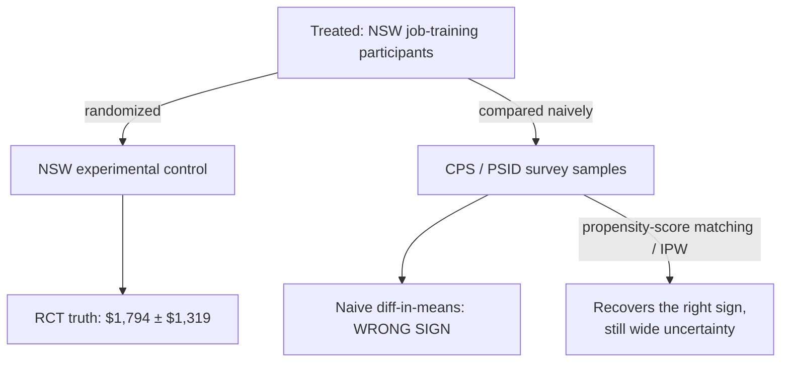
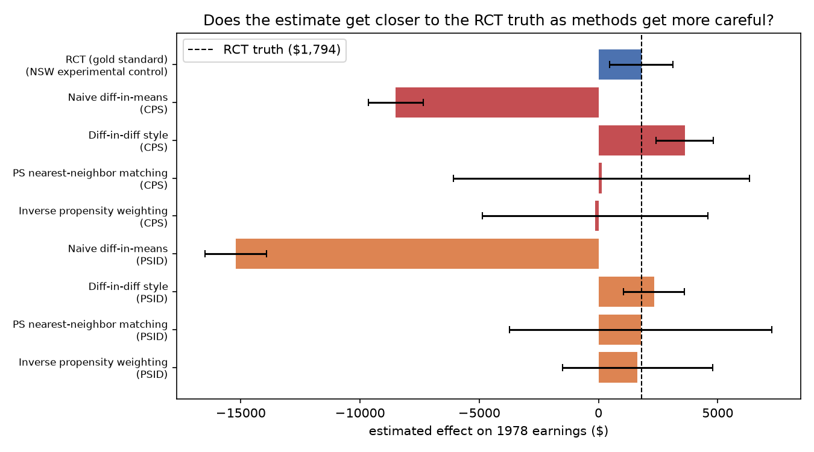
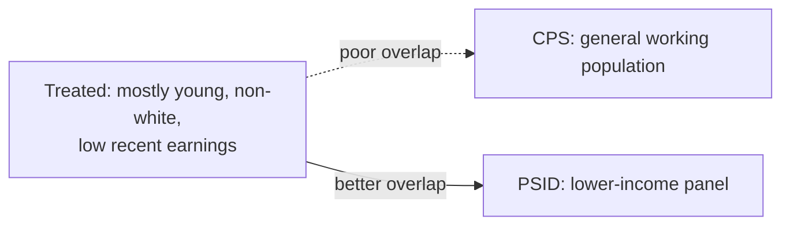
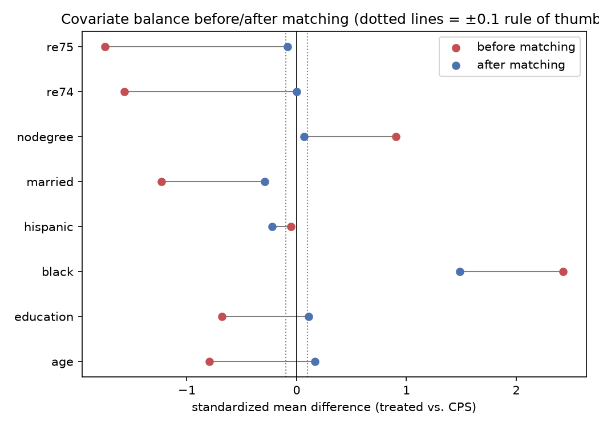

# Does Naive Comparison Lie? — Causal Inference on the LaLonde Benchmark

Answers a question every analyst eventually runs into: you have a group
that got a treatment and a group that didn't, they weren't randomly
assigned, and a simple average-outcome comparison gives you a number --
is that number even directionally right? Using the classic
Dehejia-Wahba (1999, 2002) re-analysis of LaLonde's (1986) National
Supported Work (NSW) Demonstration, this project shows the naive
comparison getting the **sign of the effect wrong**, and checks whether
propensity-score matching and reweighting can recover the truth.

**Stack:** Python, pandas, scikit-learn, SciPy, Matplotlib.

## The data

Four real datasets, same schema (age, education, race, marital status,
1974/1975 earnings as pre-treatment covariates, 1978 earnings as the
outcome):

- **NSW treated** (n=185) and **NSW experimental control** (n=260) --
  from an actual randomized controlled trial. The treated-vs-experimental-
  control difference is the **RCT gold standard**: because assignment was
  random, this is the real causal effect, not an estimate that could be
  confounded.
- **CPS comparison group** (n=15,992) and **PSID comparison group**
  (n=2,490) -- real survey samples (Current Population Survey, Panel
  Study of Income Dynamics), *not* randomly assigned to treatment. An
  analyst without access to the RCT might reach for one of these as a
  "control group" -- this is exactly the mistake this project explores.

Source: Robert Dehejia's data page (`users.nber.org/~rdehejia/data`),
the standard hosting for this benchmark since Dehejia & Wahba's
re-analysis.

## Results



| Method | Comparison group | Estimate | 95% CI half-width |
|---|---|---|---|
| **RCT (gold standard)** | NSW experimental control | **$1,794** | ±$1,319 |
| Naive diff-in-means | CPS | **-$8,498** | ±$1,144 |
| Diff-in-diff style (Δearnings) | CPS | $3,621 | ±$1,199 |
| PS nearest-neighbor matching | CPS | $130 | ±$6,207 |
| Inverse propensity weighting | CPS | -$140 | ±$4,735 |
| Naive diff-in-means | PSID | **-$15,205** | ±$1,288 |
| Diff-in-diff style (Δearnings) | PSID | $2,327 | ±$1,267 |
| PS nearest-neighbor matching | PSID | **$1,773** | ±$5,507 |
| Inverse propensity weighting | PSID | **$1,641** | ±$3,148 |



**The naive comparison doesn't just miss the magnitude -- it gets the
sign backwards**, on both non-experimental comparison groups. Read
literally, "naive diff-in-means vs. CPS" says the job-training program
made people worse off by $8,498/year. The true (RCT) effect is positive:
+$1,794/year. Using the *change* in earnings (re78 - re75) instead of
the level -- a simple diff-in-differences -- fixes the sign but
overshoots. Propensity-score matching and inverse propensity weighting
against **PSID** land close to the RCT truth ($1,773 and $1,641 vs.
$1,794); the same methods against **CPS** land near zero with very wide
uncertainty -- not wrong, but not informative either.

## Why matching didn't fully work for CPS (and the CPS numbers are noisier)





Matching against CPS reduces the imbalance on most covariates (age,
education, marital status, pre-treatment earnings) but **doesn't fix
`black`** -- the standardized mean difference on race stays around 1.5
after matching, because CPS has very few Black respondents overlapping
the treated group's propensity-score range. Checking balance *after*
adjustment (not just running the estimator and reporting a number) is
what surfaces this -- and it's the honest reason the CPS-based estimates
stay far from the RCT truth with wide confidence intervals, while the
PSID-based ones (better covariate overlap to begin with) land much
closer.

## Why this matters

Every one of these estimators ran on the same treated group and the same
outcome variable. The only thing that changed was the comparison group
and the method -- and that alone moved the answer from "this program
cost people $8,498/year" to "this program was worth $1,794/year," a sign
flip on a real policy question. Having access to ground truth here (the
actual RCT) is the rare part; being able to *check whether your
comparison group is even valid before trusting an estimate* -- via
balance diagnostics, not just running a regression and reporting the
coefficient -- is the transferable part.

## Limitations

- Small samples (185 treated, 260 experimental control) mean every CI
  here is wide; "close to the truth" point estimates (PSID matching/IPW)
  still carry a lot of statistical uncertainty, disclosed via CIs rather
  than treated as exact.
- 1970s US labor market data -- a methodology demonstration, not a
  claim about any current job-training program.
- Matching/IPW's core assumption (no unobserved confounders, conditional
  on covariates) is checkable via balance but never provable from the
  data alone -- flagged explicitly above for `black` vs. CPS, not swept
  under the rug.
- Only one matching specification (1:1 nearest-neighbor on propensity
  score, no caliper) and one weighting scheme (basic IPW with weight
  clipping) are compared; other specifications (e.g. Mahalanobis
  distance, doubly-robust estimators) might do better on CPS.

## How to run

```bash
python -m venv .venv
.venv/Scripts/activate  # or source .venv/bin/activate on Linux/Mac
pip install -r requirements.txt
python src/analysis.py
```

## Files

```
src/
  load_data.py     # loads NSW treated/experimental-control + CPS/PSID comparison groups
  balance.py       # standardized mean difference (covariate balance) diagnostics
  matching.py      # propensity-score nearest-neighbor matching + inverse propensity weighting
  analysis.py      # ties it together: RCT truth, naive, DiD-style, matched, IPW estimates
  utils.py         # t-based and bootstrap confidence intervals
data/
  nsw_dw.dta       # NSW experimental sample (Dehejia-Wahba processed)
  cps_controls.dta # CPS non-experimental comparison group
  psid_controls.dta # PSID non-experimental comparison group
results/
  figures/         # ATE comparison plot, Love plot
  tables/          # ATE estimates, balance tables
```
